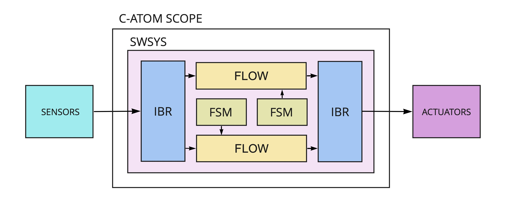

# C-ATOM
see-atom, carbon-atom, C language-atom is a scalable framework to create embedded 
systems faster by the combination of the top level declarative programming of the behaviour;
model-based enabled design and service code generation. C-ATOM uses so-called atomic 
functions as formally defined and isolated building blocks. 

Key features:
- written in C language;
- libc, pthreads, libm are the only dependencies;
- uses POSIX for system calls;
- designed to be hardware and software-agnostic.
- provides services for telemetry transmission, logging and visualizing.

# Documentation

Available [here](https://docs.ctlst.app/catom/intro.html)

# Demos and usecases

1. [Drone's autopilot CatPilot](https://github.com/ctlst-tech/uas-catpilot)
2. [Autopiloting of the flight simulator's model of Cessna 172](https://github.com/ctlst-tech/c172atom)

# How it works

Library has the following major building blocks and configuration layers:
- **flow** - block to arrange computational graphs as a sequence of atomic reusable (C lang coded) functions.
- **fsm** - finite state machine block, operates by states, transitions and actions on states and transitions.
- **ibr** - interface bridge - designed to take care of converting information from and to other devices.
- **swsys** - software system description layer; allocates functions and other blocks into tasks and process.

The foundation of the **c-atom** is [Embedded Software Bus (ESWB)](https://github.com/ctlst-tech/eswb) library. 
ESWB creates uniform way of functions to communicate between each other: inside thread, between threads, between processes.
Stands as the only form of inter process communication inside **c-atom** controlled domain. 

Find more info at [documentation](https://docs.ctlst.app/catom/intro.html)
